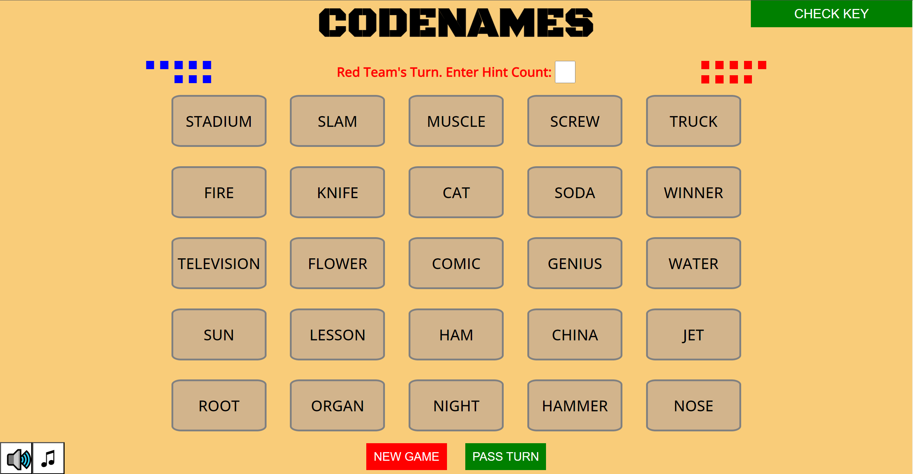
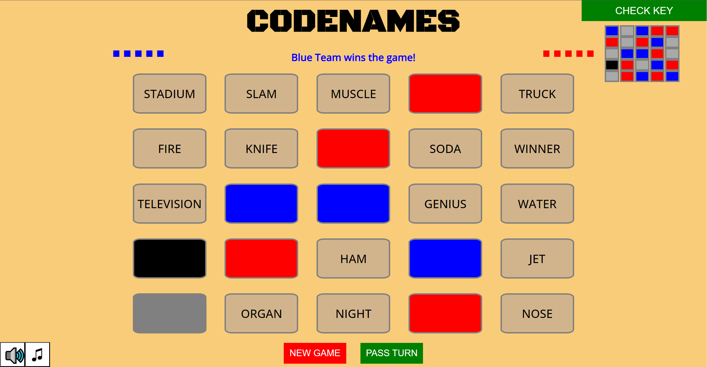

# CODENAMES #

## Description ##
### Overview ###
Spymasters know the secret identities of 25 agents. Their teammates know the agents only by their
codenames. Spymasters take turns giving ONE-WORD clues. A clue may relate to multiple words on the table. The field
operatives try to guess which words their spymaster meant. When a field operative touches a word, the
spymaster reveals its secret identity. If the field operatives guess correctly, they may continue guessing,
until they run out of ideas for the given clue or until they hit a wrong person. Then it is the other team's
turn to give a clue and guess. The first team to contact all their agents wins the game. 

### Gameplay ###
Each team will designate one player to be their Spymaster. Being a Spymaster isn't a simple task but gets
easier each time you try! ONLY THE SPYMASTER CAN LOOK AT THE KEY. At the start of your team's turn, your team's Spymaster will create a clue using just ONE WORD. They'll also include a number after the word, indicating how many words on the board correspond to that. For example, if the Spymaster gave the clue "Fruit 2", you should look through the board to see which words could match that description. Once you click on a card, one of four results will occur:
- If you select a card with YOUR TEAM'S COLOR, you contact your agent and can continue guessing.
- If you select a card with the ENEMY TEAM'S COLOR, their agent is contacted and you can no longer guess.
- If you select a NEUTRAL CARD (gray color), you can no longer guess.
- If you select THE ASSASSIN (black color), you LOSE the game instantly.

## Game Images ##
Here's some screenshots of the application!

## Technologies Used ##
- HTML
- CSS
- JavaScript
## Getting Started ##
To play CODENAMES, click this link! [Play CODENAMES!](https://davidthecarey.github.io/project1/)  
If you've never played CODENAMES before, I'd recommend reading the Description section above.
## Next Steps ##
There's a few changes I would like to implement if I had more experience and time with this project. The sounds and animations
I used for this project were pretty rudimentary. I had to make some concessions for the start-game card flip animation and the sounds are less thematic and engaging than I had wanted. I also would have liked the actual art assets for the cards from the board game but I couldn't find them online (having them just flip to the color is a practical solution regardless). Having actual background art would be nice additionally. 

## Early Wireframe ##
If you're curious to see what the early wireframe for this project was like, check it out!
